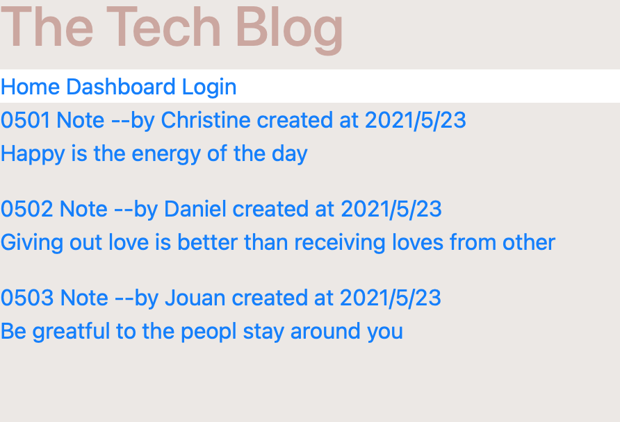

   

# 14.Model-View-Controller (MVC): Tech Blog

## Description
We had been learning how to use node and sequalize to connect database and server and also using handlebars to switch route and pages. I learn how to structure connection between database and grab the information from database to show properly on the handlebar template which also using route to update the database. It was challenge to get the information associated with each other front and back and using route for specific detail into back-end server. Over all I enjoy the process of seeing database being edit, add and delet by GET, POST and PUT methods. 

## Installation:

Clone the repository to your local development environment.

```
git clone git@github.com:anniechen9025/tech-blog.git
```

Run `npm install` in your terminal to install all dependencies. To run the application locally, run `node server.js` in your CLI, and then open `http://localhost:3001` in your preferred browswer. The Tech Blog app is [live on Heroku](https://jouan-tech-blog.herokuapp.com) for you to use as well.


## Deployed Link:
[Tech Blog](https://jouan-tech-blog.herokuapp.com)

[](https://jouan-tech-blog.herokuapp.com)

## Example:



## Built With:
- [HTML5](https://html.com/html5/)
- [CSS](https://www.w3.org/Style/CSS/)
- [Javascript](https://www.javascript.com/)
- [Node.js](https://nodejs.org/en/)
- [Express.js](https://expressjs.com/)
- [MySQL2](https://www.npmjs.com/package/mysql2)
- [Sequelize](https://sequelize.org/)
- [Handlebars.js](https://handlebarsjs.com/)

## License
MIT 

## Badges


## Questions
        Please feel free to contact: 
        Github:https://github.com/anniechen9025/
        Email:anniechen9025@gmail.com
